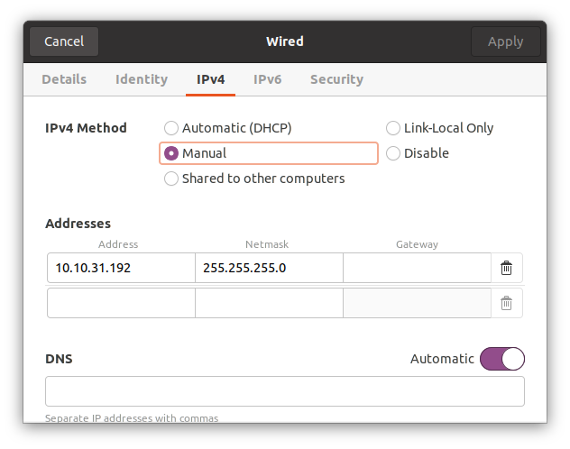
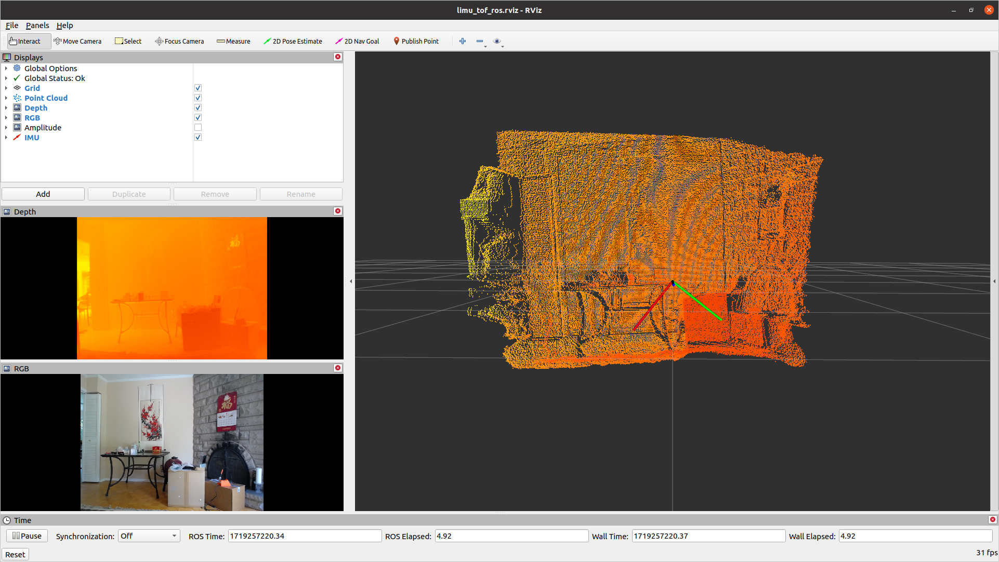
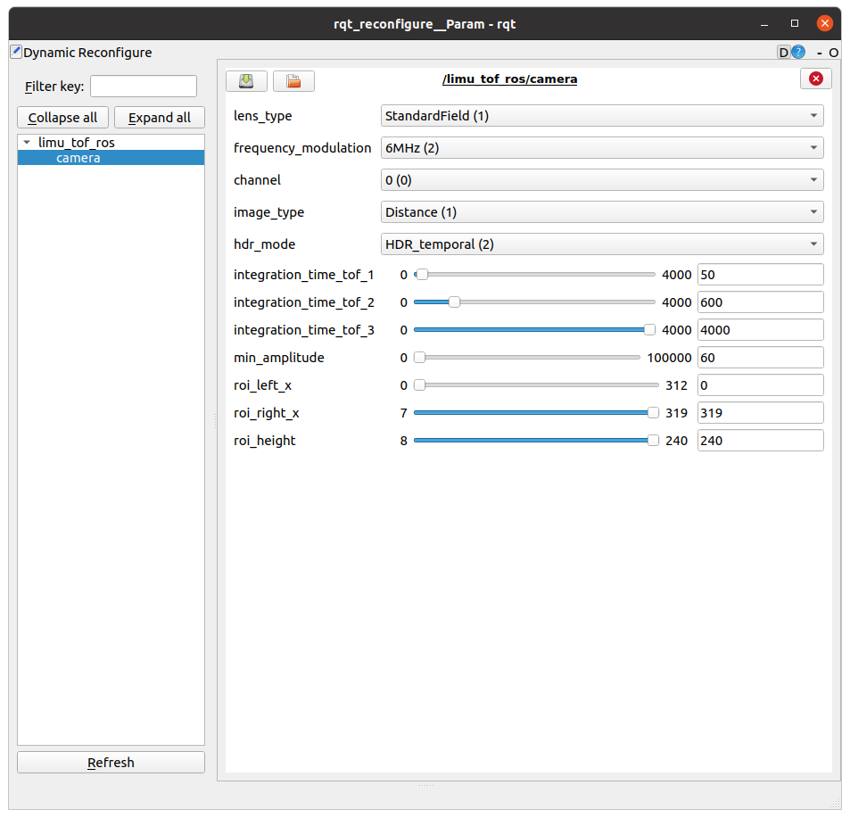

# Limu ToF Sensor
## Introduction
Limu Lidar Sensor
## List of Components/Tools
- Ethernet cable to connect sensor to PC (or router)
- Limu Lidar Sensor
- Linux PC
- AC/DC Adapter with 24V and 4A output
- (Optional) Router with stable network connection
## Prerequisite
- Install ROS in your Ubuntu environment, please refer to the instruction:
  https://wiki.ros.org/Installation/Ubuntu
## Quick Start
1. Power on sensor and connect it to PC using network cable
2. Once connected, go to network settings and under 'Wired' click the configuration button

4. Refer to above screenshot. Click on 'IPv4', then under 'IPv4 Method' click 'Manual'
	- Under 'Address', add a static IP address to PC in the form of ```10.10.31.XXX```, the last 3 digits cannot be exactly 180 since that is the sensor's static IP address
	- Under 'Netmask', add ```255.255.255.0```
	- Finally, click 'Apply' and wait for PC to be connected
5. Run ```ifconfig``` to verify the above settings
6. Run ```ping 10.10.31.180``` to ensure there is a connection to sensor
	- If connection fails, try restarting sensor before this step
7. In limu_tos_ros folder, to view sample, run:
```
catkin_make
```
```
sudo -s
```
```
./run.sh
```
## Sample Application
In the sample application, there is the point cloud, depth map, and RGB views

## Changing Configurations
In sensor configuration, there any many settings that will affect the image produced. Refer to below screenshot

- **lens_type** can be changed between 3 modes, WideField, StandardField, and NarrowField. Refer to specs documentation for more details
- **frequency_modulation** can be used to change the frequency modulation. It is suggested to use the default (6MHz).
- **channel** can be used to allow multiple sensors to be used in close proximity without interfering with each other. Sensors on different channels will not affect the infared light of another sensor if they happen to be in the same room and/or used next to each other
- **image_type** can be changed between Distance and DistanceAmplitude. If DistanceAmplitude is chosen, an amplitude map will also be generated, but this will not show up by default and must be selected as well
- The three **integration_time_tof** settings will change the time in which the sensor collects photons to create a signal. A smaller integration time will detect close and/or reflective (such as white coloured) objects, but not other objects. A larger integration time will detect close and/or reflective objects too indiscriminately, but will detect further and/or non-reflective (such as black coloured) objects. Depending on hdr_mode, different integration times out of the 3 given will be used
- **hdr_mode** will change which and how many integration times are used
	- In HDR_off, only the first integration time is used
	- In HDR_spatial, the only the first integration time is used, but it is split into 2, with one being the original integration time and the other being half of that. The two are then combined, giving the benefits of using two integration times at the cost of halving the image's resolution. This preserves the framerate, unlike HDR_temporal.
	- In HDR_temporal, all three are used; this can give the benefits of both small and large integration times, meaning objects both close and far, reflective and non-reflective can be detected. However, this may result in a lower framerate than other modes
- **min_amplitude** can be used to remove any noise that can affect the image by causing the image to become less sensitive to ambient infared light, such as from the sun. It can also be used to ignore further and/or les reflective objects in the image at higher values
## Developing you own application
## The basics
 - Refer to the sample application
 - Copy and driver headers and lib over to your application
 - Refer to the limu_camera_node.cpp
 - Create instance of ToF camera:
```
   tof = ToF::tof320("10.10.31.180", "50660");
```
 - Connect callbacks:
```
    tof->subscribeFrame([&](std::shared_ptr<Frame> f) -> void {  updateFrame(f); });
```
 - Start streaming:
```
    tof->streamDistance();
```
 - Implement callback function:
```
void updateFrame(std::shared_ptr<Frame> frame)
{
    pcl::PointCloud<pcl::PointXYZRGB>::Ptr cloud(new pcl::PointCloud<pcl::PointXYZRGB>);

    pcl::PointXYZRGB* data_ptr = reinterpret_cast<pcl::PointXYZRGB*>(frame->data_3d_xyz_rgb);
    std::vector<pcl::PointXYZRGB> pts(data_ptr, data_ptr + frame->n_points);
    cloud->points.insert(cloud->points.end(), pts.begin(), pts.end());
}
```
## Troubleshooting
- Ensure sensor is plugged in
- Ping sensor to ensure it is plugged in
- Remember to use a different static IP address than the sensor for your PC

## Troubleshooting RGB and IMU:
Currently the LiMu has 1 power cable and 2 ethernet cables:

1. ToF 3D, directly connected to PC.
2. RGB camera & IMU, needs a converter provided by VSemi, converts the ethernet to 2 USB ports, one is for RGB camera and another one is for IMU.
You can run the demo program by completely ignoring the RGB camera & IMU, there is just a warning in the console that RGB and IMU are not available.
If you would like to use the RGB camera and the IMU, connect the RGB camera & IMU ethernet cable to the converter and plug in the 2 USBs.

####In case RGB or IMU is not working:

- Edit the file camera.launch under folder limu_tof_ros/launch folder, 

- Verify if the RGB camera ID is correct at line 19:
```
<arg name="rgb_camera" default="/dev/v4l/by-id/usb-046d_Logitech_Webcam_C930e_986A01BE-video-index0"/>
```
You may run a command:
```
ls /dev/v4l/by-id
```
the result should be:
```
usb-046d_Logitech_Webcam_C930e_986A01BE-video-index0
```
- to check if the RGB camera ID matches the one in the file camera.launch under folder limu_tof_ros/launch folder.

- Verify if the IMU port is correct at line 20, make sure the USB port of IMU matches the one in file camera.launch under folder limu_tof_ros/launch folder.
```
/dev/ttyUSB0
```
## Contact
Contact us:  [info@vsemi.io](mailto:info@vsemi.io)
